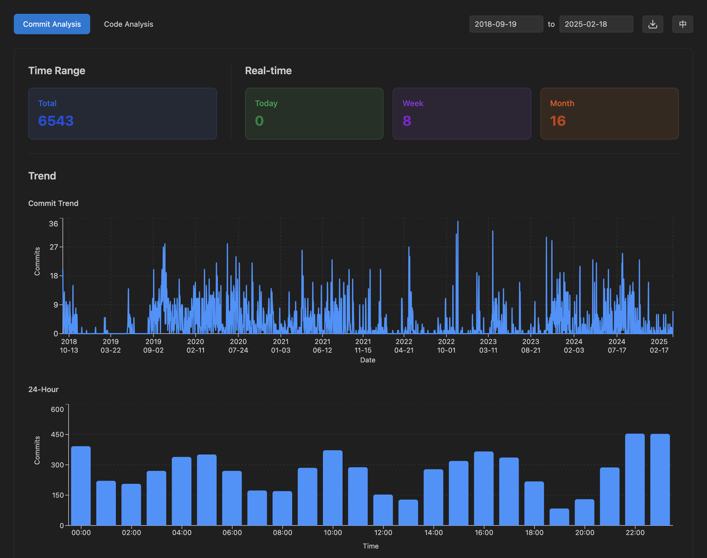
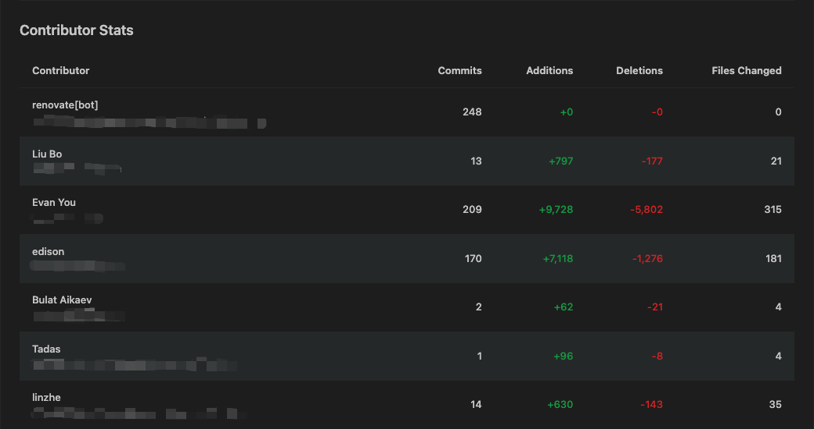
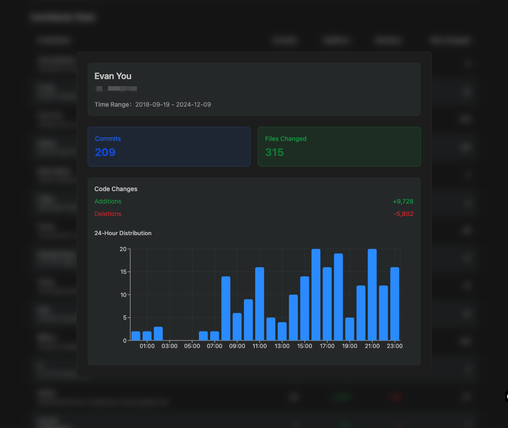
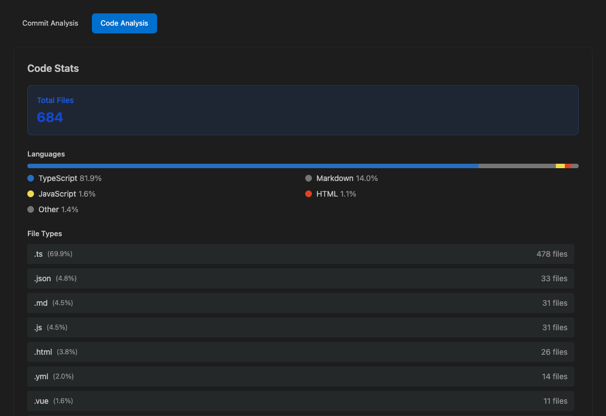
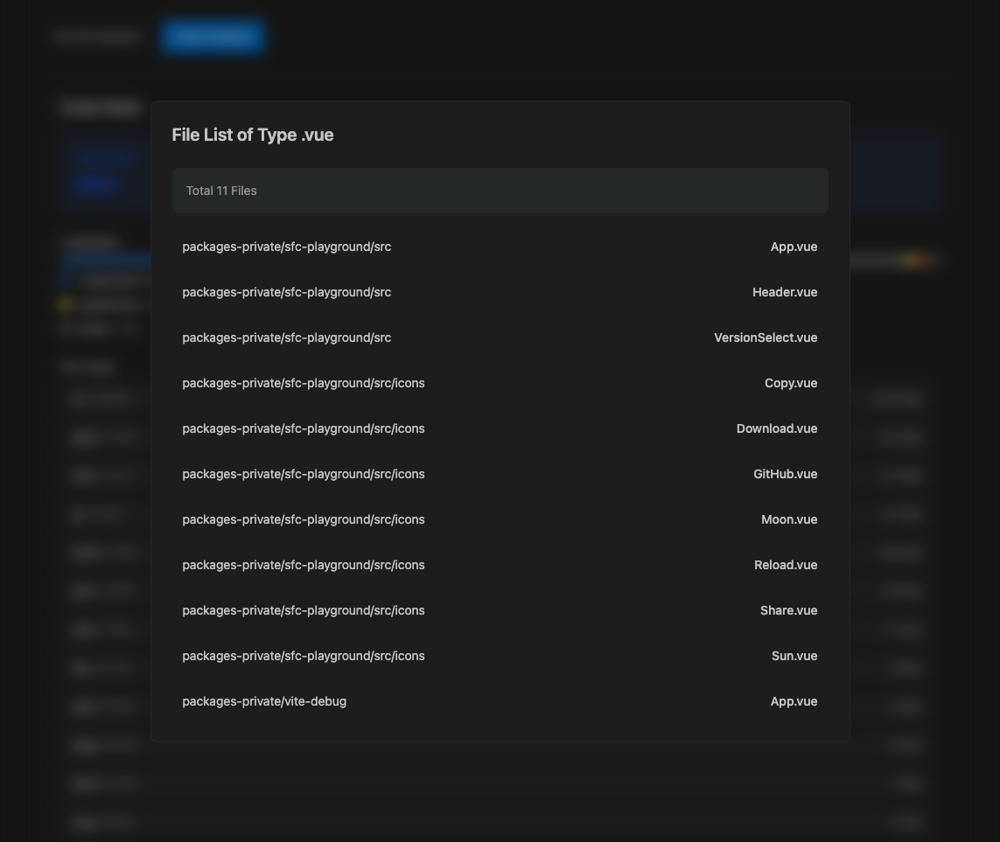
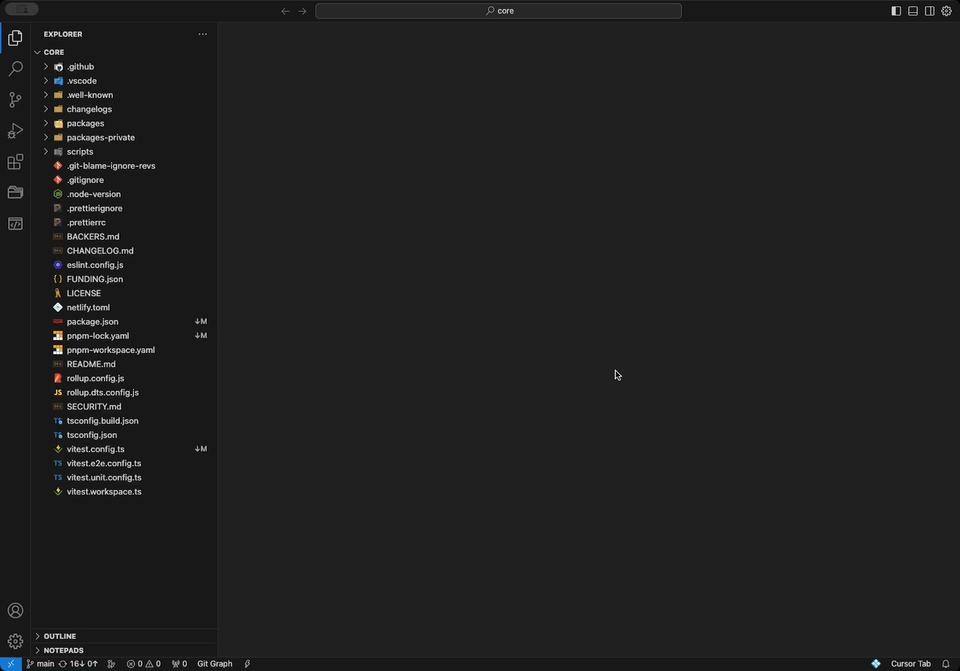
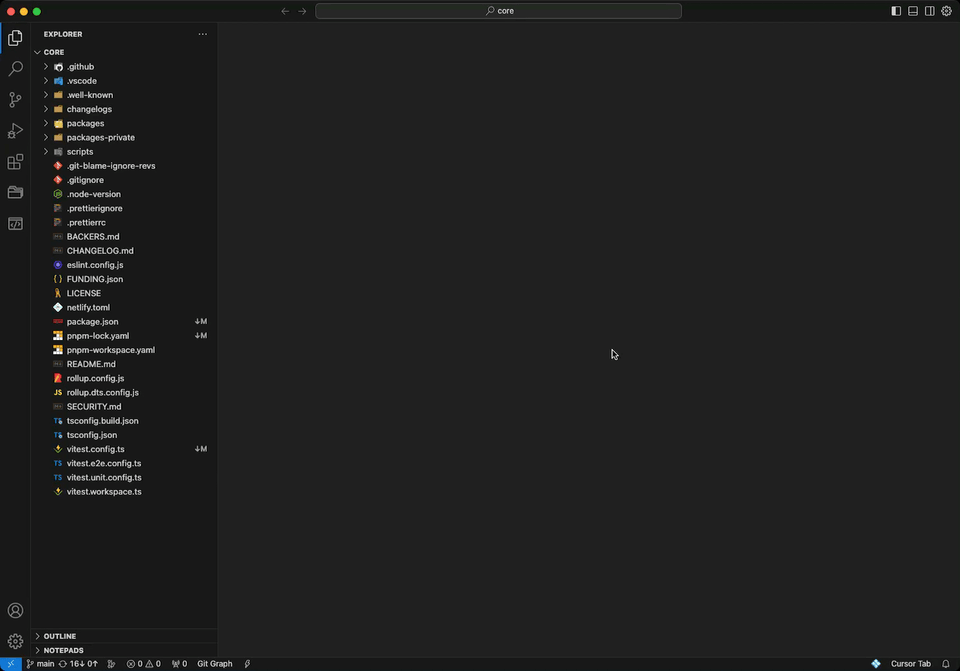

> This repository is used to collect feedback for: [gitdashboard](https://marketplace.visualstudio.com/items?itemName=coder-yolo.gitdashboard)
> --
> Here is the introduction to the extension. When the extension is refined to my satisfaction, I will release the source code.
# Git Dashboard - Analyze Your Code 🧑‍💻

  
An extension for analyzing Git repositories, including commit analysis and code analysis

  
<strong>JUST FOR FUN.</strong>

## Features

### Commit Analysis

  

Commit Analysis provides statistical data from multiple dimensions:

- **Commit Overview**: Summarize overall commit activity.
- **Trend Statistics**: Visualize commit trends over time.
- **24-Hour Distribution**: Commit distribution by time of day.
- **Contributor Stats**:
  - Overview of contributors and their impact.
  

    
  

  - Detailed insights into individual contributors.
  

    
  

> **Note**: Example images use mosaic to hide the email data of contributors.

---

### Code Analysis

  

Analyze repository content with a focus on file composition and language usage:

- **Total Files**: Get the total number of files in the repository.
- **Languages**: Identify the programming languages used.
- **File Types**: Analyze file types and distribution.
  - Detailed breakdown of specific file types.
  

    
  

## Usage

### Click the icon

  

### Use command

  

---

> **Attention:**
>
> By default, the plugin uses the time range from the **first commit** to the **most recent commit** in the Git repository for statistics.
>
> If the repository has a large number of commits or involves many contributors, this may lead to **slower response times** during initial data loading or when adjusting the time range.
>
> For the above problems, I suggest that you **_wait 1 minute_** after you start vscode before trying to open the extension.

I will optimize this problem in subsequent versions.

  
Thank you for using <strong>Git Dashboard</strong>! 😃

